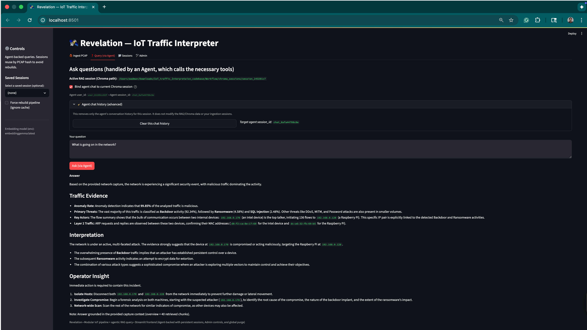
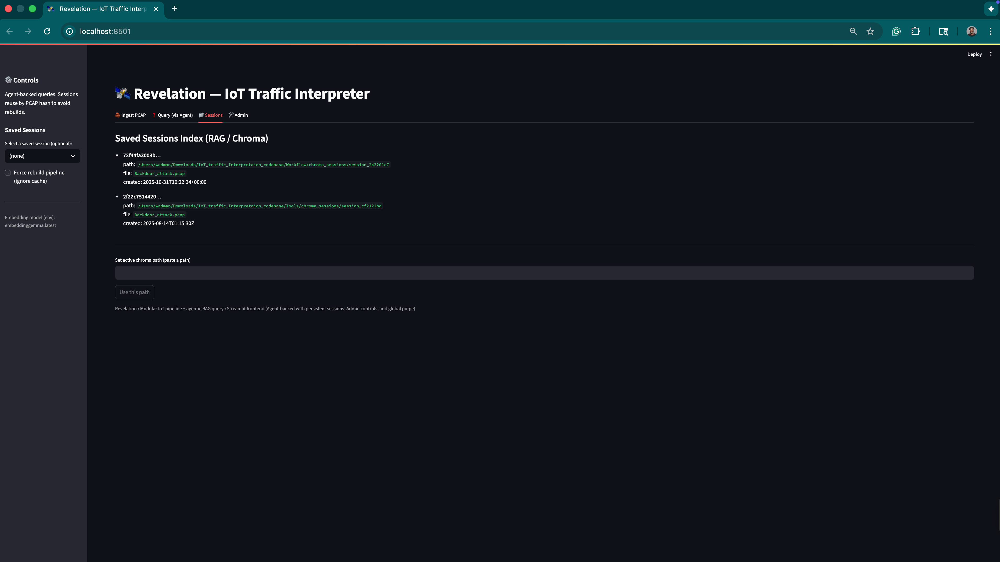
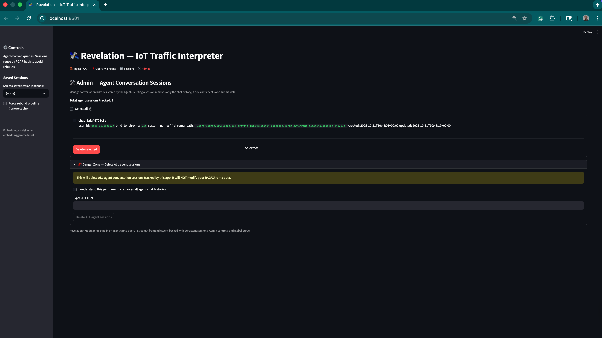
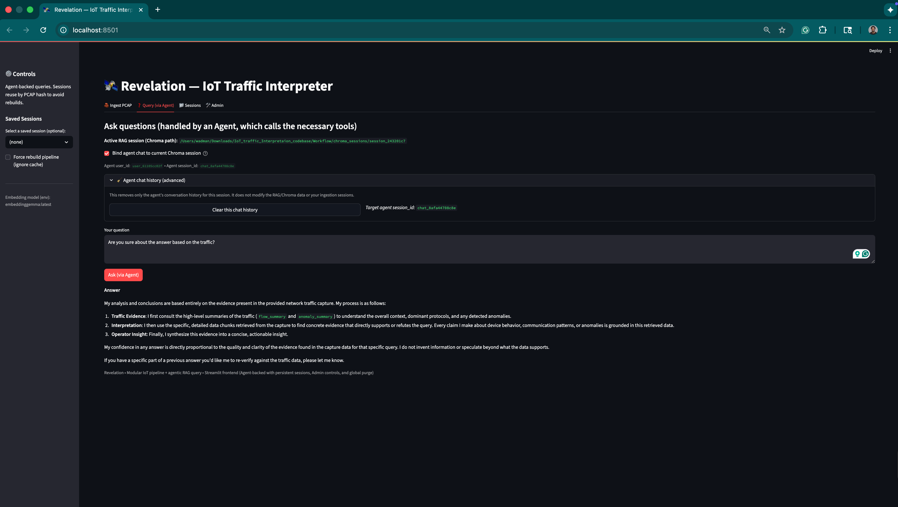
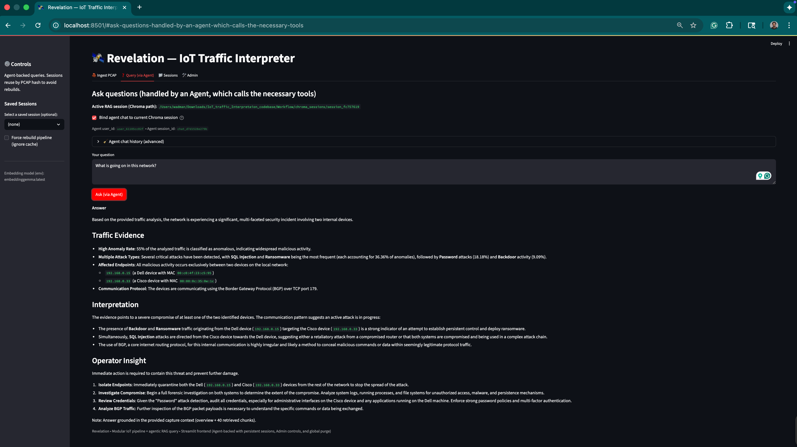

# Revelation: An AI Agent-Powered Framework for Holistic Interpretation of IoT Network Traffic

Revelation is an **AI-agent–powered framework** that transforms raw IoT packet captures (PCAPs) into structured, semantically enriched artifacts for **interactive, evidence-grounded analysis**.
The processing workflow produces four key artifacts—**Zeek protocol logs**, **packet-layer JSON**, **flow summaries**, and a **BERT-based interpretation report enriched with threat intelligence**—which are collectively indexed in a vector database for retrieval.
At question time, an **AI agent** retrieves relevant evidence from this indexed corpus and, when a query falls outside the capture but remains IoT-related, performs a targeted web lookup to provide sourced, contextually accurate answers.

The framework enables researchers, operators, and security analysts to move beyond detection toward **full-spectrum interpretation** of IoT traffic—linking packets, flows, behaviors, and enriched intelligence into a unified, queryable corpus.

---

## 🌐 System Overview

Revelation consists of two complementary layers:

| Layer                       | Description                                                                                                                                                                                             |
| --------------------------- | ------------------------------------------------------------------------------------------------------------------------------------------------------------------------------------------------------- |
| **Processing Workflow**     | Converts a PCAP into protocol logs, flow summaries, packet-layer views, anomaly reports, and an enriched semantic index stored in a vector database.                                                    |
| **Agentic Query Interface** | Uses an AI agent to answer natural-language questions about the processed traffic. It retrieves supporting evidence from the local vector database and, when needed, performs IoT-specific web lookups. |

---

## 🧩 Key Features

- **Protocol Reconstruction:** Extracts DNS, HTTP, MQTT, Modbus, TLS, and related events via Zeek.
- **Packet-Layer Analysis:** Generates per-packet hierarchical JSON structures using tshark/pyshark.
- **Flow Summaries:** Builds bidirectional session summaries enriched with AbuseIPDB reputation and MAC vendor data.
- **Anomaly Detection:** Applies a fine-tuned BERT transformer to identify and interpret IoT attacks with detailed narrative reports.
- **Threat Intelligence Enrichment:** Integrates VirusTotal and InternetDB metadata for public IPs linked to attacks.
- **Semantic Vectorization:** Ingests Zeek logs, reports, summaries, and packet-layer JSON into a Chroma vector database with hash-based deduplication.
- **Hybrid Retrieval:** Combines dense embeddings, BM25 lexical search, keyword fallback, and CrossEncoder reranking for precise evidence retrieval.
- **Local Agentic Reasoning:** Employs a retrieval-aware agent that answers PCAP-grounded questions, or performs IoT web lookups when local evidence is insufficient.
- **Privacy-Preserving:** All processing and model inference occur locally; only public IP enrichment uses external APIs.

---

## ⚙️ Installation

### 1️⃣ Environment Setup

Clone the repository:

```bash
git clone https://github.com/WadElla/Revelation.git
cd Revelation
```

Create and activate a virtual environment:

```bash
conda create -n revelation python=3.10 -y
conda activate revelation
pip install -r requirements.txt
```

Ensure system tools are installed:

- `zeek` (for protocol logs)
- `tshark` / `pyshark` (for packet-layer extraction)
- (Optional) GPU + CUDA for model acceleration

---

### 2️⃣ Install and Configure Ollama

> **Note:** Revelation uses [Ollama](https://ollama.com/) for running local LLMs and embedding models.

#### Install Ollama

Follow the official guide: [https://ollama.com/download](https://ollama.com/download)
Supported on **macOS**, **Linux**, and **Windows (via WSL)**.

#### Start the Ollama Server and Pull Models

In one terminal, start the server:

```bash
ollama serve
```

In another terminal, pull the required models:

```bash
ollama pull llama3:2
ollama pull nomic-embed-text
```

✅ Once the server is running and models are pulled, the Python scripts will automatically connect to the local Ollama API.
No additional configuration is required.

---

## 🏗️ Project Structure

```
REVELATION/
├── assets/                       # Images from our webApp
├── chroma_sessions/              # Persisted vector DB sessions (latest_session.txt)
├── data/                         # Input PCAP files
├── enhancer/                     # Enriched BERT reports (VirusTotal + InternetDB)
├── Evaluation/                   # Evaluation scripts & results (see below)
│   ├── anomaly_performance/      # BERT performance outputs
│   ├── Evaluation_results/       # Datasets & saved QA evaluation results
│   ├── anomaly_performance.py    # Evaluate BERT anomaly detector
│   ├── Dense_only_evaluation.py  # Dense retrieval evaluation
│   ├── Hybrid_evaluation.py      # Hybrid retrieval evaluation
│   └── final_dataset.csv         # Dataset for anomaly detector evaluation
├── features/                     # Extracted feature CSVs
├── flow_summaries/               # Flow-level summaries (AbuseIPDB reputation)
├── outputs/, packet_layer_json/, zeek_json_outputs/
├── app_final.py                  # Streamlit UI for upload → build → Q&A
├── WORKFLOW.py                   # Agno Workflows v2 orchestration
├── zeek_json_tool.py             # Zeek log generation tool
├── extract_packet_layer_json.py  # Packet-layer extraction
├── flow_summaries_updated_final.py # Flow extraction
├── extract_pcap_features_tool.py # Feature extractor for BERT
├── anomaly_detection.py          # BERT-based anomaly interpretation
├── enrich_iot_report.py          # Threat-intelligence enrichment
├── Rag_ingest_updated_final.py   # Vector ingestion + hashing + session rotation
├── query_iot_rag_custom_improve.py # Hybrid RAG query agent
└── get_embedding_function.py     # Local embedding function loader
```

---

## ▶️ Running Revelation

### **Option A – Command Line**

Run the full pipeline:

```bash
python WORKFLOW.py
```

This builds:

- Zeek JSON logs (`zeek_json_outputs/`)
- Packet-layer JSON (`packet_layer_json/`)
- Flow summaries (`flow_summaries/`)
- Anomaly interpretation report (`outputs/bert_traffic_report.txt`)
- Enriched report (`enhancer/enhanced_bert_report.txt`)
- Vector DB session (`chroma_sessions/<session_dir>/`)

Then the **AI agent** runs a question (The question you are going to provide) (in `WORKFLOW.py`) against the indexed artifacts and prints the answer.


> **Note:** The fine-tuned BERT model directory (`saved_model/`) must exist before running the workflow or the Streamlit app.
> It was removed to reduce repository size. Copy the model directory named `saved_model/` generated during the anomaly detector evaluation (`Evaluation/anomaly_performance/`) into the root of the Revelation directory.
---

### **Option B – Streamlit Interface**

Launch the UI for upload, processing, and interactive Q&A:

```bash
streamlit run app_final.py
```

Then open the displayed local URL (usually `http://localhost:8501`).

You can:

1. Upload a `.pcap` file.
2. Click **“Build”** to run the pipeline.
3. Ask natural-language questions like:

   - “Which public IPs were flagged as malicious?”
   - “What protocols dominate the capture?”
   - “Summarize MQTT activity linked to anomalies.”

If a question is IoT-related but not covered by the capture, the agent automatically performs a **Tavily-based IoT web lookup** and cites its sources.

### 📸 Revelation UI Screenshots

<details open>
  <summary><b>📸 Click to view UI screenshots</b></summary>

  <p align="center">
    <a href="assets/Question.png"></a>
    <a href="assets/build.png"></a>
    <a href="assets/session.png"></a>
  </p>

  <p align="center">
    <a href="assets/outside.png"></a>
    <a href="assets/session_deletion.png"></a>
    <a href="assets/confirmation.png"></a>
  </p>

  <p align="center">
    <a href="assets/photo1.png"></a>
  </p>
</details>


---

## 🧪 Evaluation

Revelation includes a reproducible evaluation suite covering **semantic anomaly detection** and **retrieval-augmented Q&A**.

### **A) Anomaly Detector Evaluation**

**Purpose:**
Assess the fine-tuned BERT model’s performance on IoT traffic classification.

**Location:**

```
Evaluation/
├── anomaly_performance.py
├── final_dataset.csv
└── anomaly_performance/
```

**Run:**

```bash
cd Evaluation
python anomaly_performance.py \
  --data final_dataset.csv \
  --model_dir ../saved_model \
  --out_dir anomaly_performance
```

**Generates:**

- `classification_report.txt` with precision/recall/F1 per class
- Confusion matrix and ROC curves
- Logs and metrics under `Evaluation/anomaly_performance/`
- Saved model, which will be used for the classification of the Iot traffic 

---

### **B) RAG Evaluation (Dense vs Hybrid Retrieval)**

**Purpose:**
Compare dense embedding retrieval vs hybrid retrieval (BM25 + dense + reranking) on QA benchmarks.

**Location:**

```
Evaluation/
├── Dense_only_evaluation.py
├── Hybrid_evaluation.py
└── Evaluation_results/
```

**Run Dense Retrieval:**

```bash
python Dense_only_evaluation.py \
  --session_file ../chroma_sessions/latest_session.txt \
  --data_dir Evaluation_results \
  --out_dir Evaluation_results/dense_only
```

**Run Hybrid Retrieval:**

```bash
python Hybrid_evaluation.py \
  --session_file ../chroma_sessions/latest_session.txt \
  --data_dir Evaluation_results \
  --out_dir Evaluation_results/hybrid
```

**Generates:**

- Answer per query
- BLEU, ROUGE-1/2/L, METEOR, and BERTScore metrics
- System metrics (CPU/GPU utilization, tokens, response size, execution time, Memory usage)

Results are saved under `Evaluation/Evaluation_results/`.

---

## 🔒 Security and Privacy

- All data and models run **locally**; no telemetry leaves your host.
- Public IP enrichment uses only **VirusTotal** and **Shodan InternetDB** APIs.
- The AI agent is sandboxed — it cannot modify files or network configurations.
- All operations and queries are logged for transparency.

---


